# Meeting-time-Scheduler
### 대학생을 위한 겹공강 찾기 프로그램
- 2020-1 <사이버보안기초프로젝트> 결과물   
* 개발 환경: Linux   
* 개발 방식: C programming, tcp/ip Network programming   
* 개발자: 김서현, 김윤서, 김채연, 한근영 (이화여자대학교 사이버보안전공)   

## 1. 소개
프로젝트명: **<겹공강을 찾아서>**   
  회의, 식사 등을 목적으로 약속을 잡을 때, 상대방과 일정이 없는 시간을 비교하여 조율함에 번거로움이 있다. 특히, 여러 명이 모이는 경우 비교에 큰 어려움이 발생한다.
  따라서, 이 문제를 해결해줄 "대학생 겹공강 찾기 프로그램"을 제작하고자 하였다.   
  본 프로그램은 **만남 가능한 시간을 찾아주어 약속을 잡는 데 도움을 준다.** 참석 대상들이 시간표를 입력하면 사용자들의 **'공강' 시간을 비교**하여, 모두가 참석 가능하거나 가장 많은 사람들이 **참석 가능한 시간을 알려준다.** 또한 **참석 여부 확인, 예약 문자 전송 기능**을 추가하여 프로그램 내에서 약속을 최종적으로 정할 수 있도록 한다.

## 2. 기능 명세서
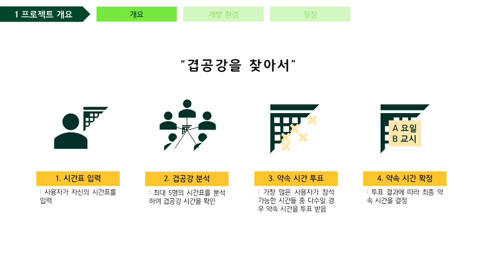

## 3. 모듈 설명
### (1) Static Diagram
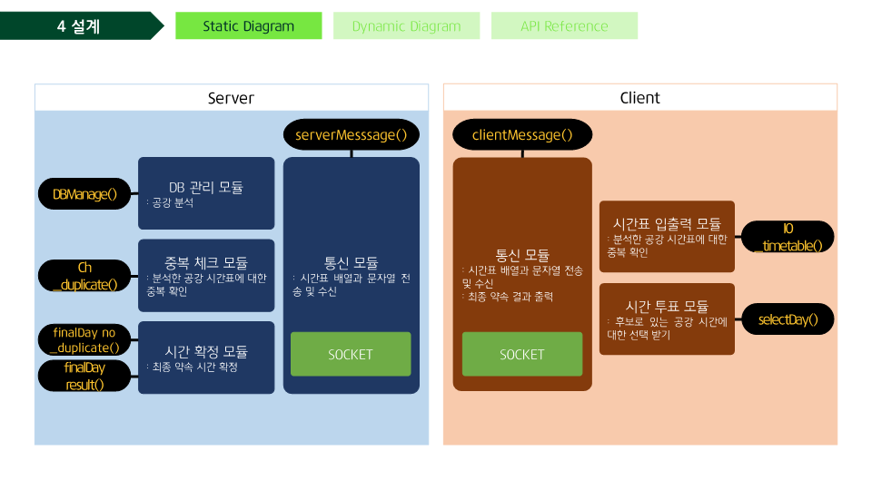

### (2) Dynamic Diagram
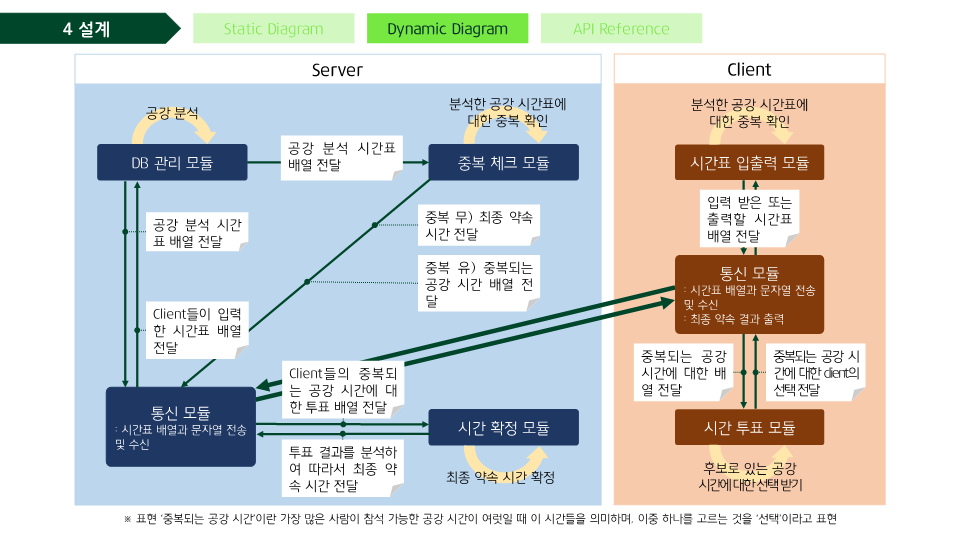 

## 4. API References
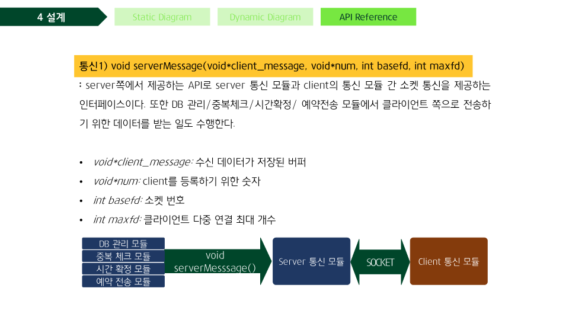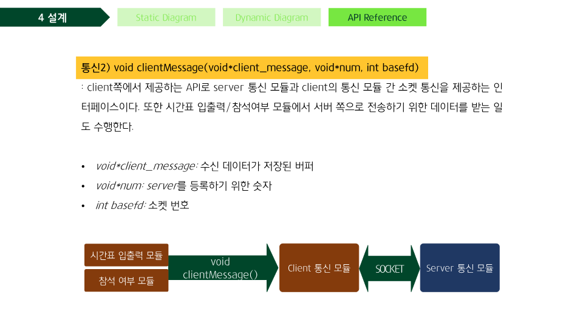
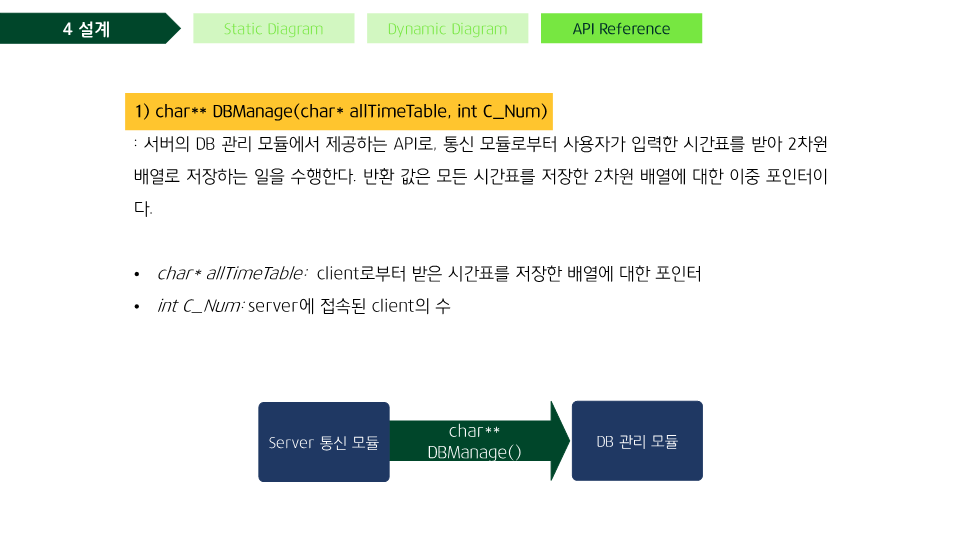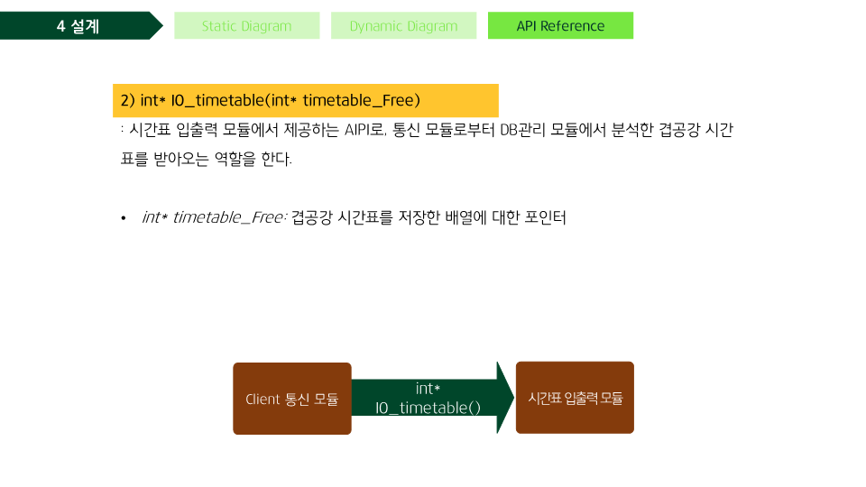
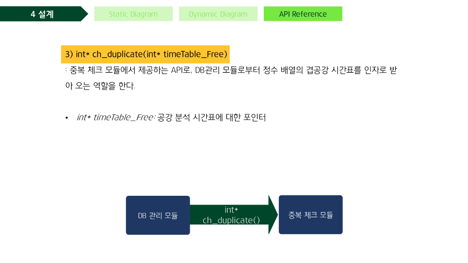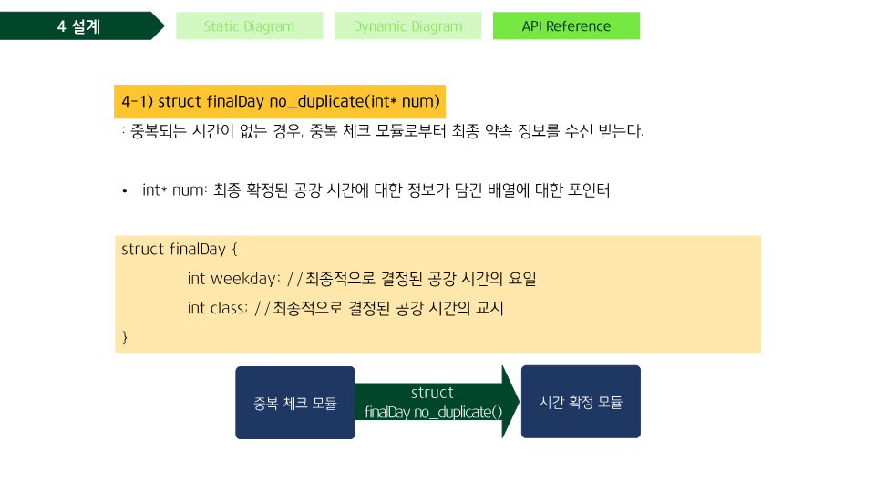
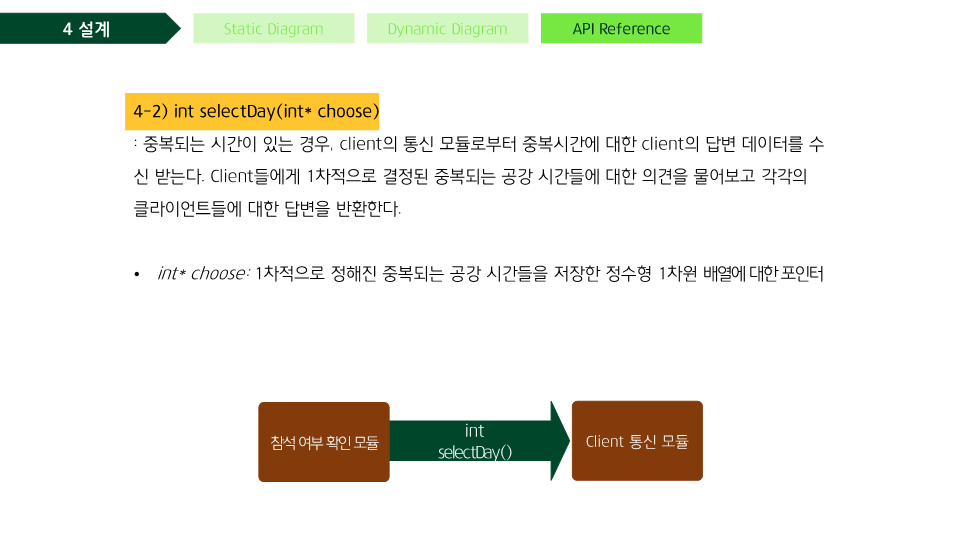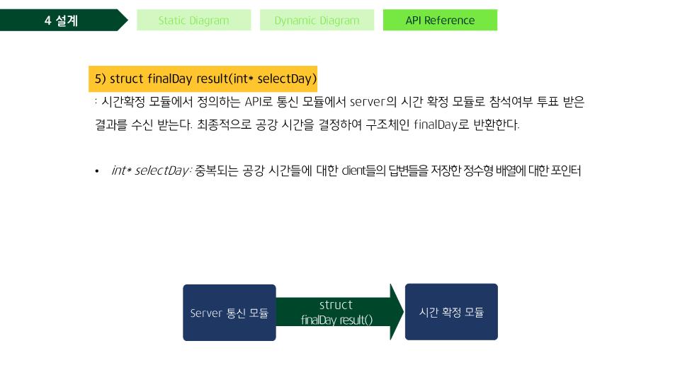
